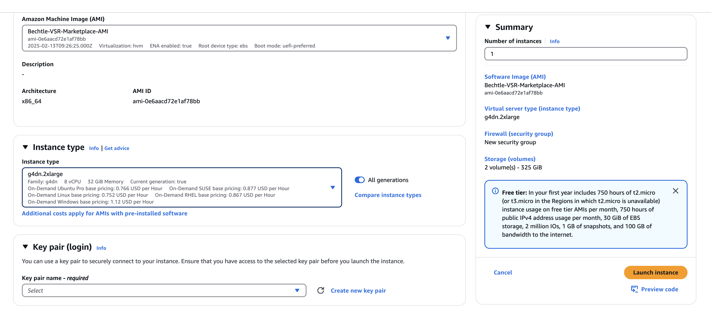

**Table Of Contents**

[1 CREATING AN INSTANCE WITH Bluewhale AMI](#1-creating-an-instance-with-Bluewhale-ami)<br/>
[2 TRY OUR SR SOLUTIONS](#2-try-our-sr-solution)<br/>
[3 REFERENCES](#3-references)<br/>
[4 LIVE USE CASES FOR BLUEWHALE-VSR AMI WITH AWS ELEMENTAL](#4-live-use-cases-for-bluewhale-vsr-ami-with-aws-elemental)<br/>

---

# 1 Creating an instance with Bluewhale AMI

## PROCEDURE

### Step 1. Choose the AMI we shared

- Click “Launch instance” in EC2 console
- Type "Bluewhale" in the search box and select it.

### Step 2. Choose g4dn.2xlarge instance

choose g4dn.2xlarge
<br/>

<br/>

### Step 3. Review and launch the instance

- Create a private key if you have no existing key and download it.
  <br/>
  
  <br/>
- Click "Launch Instances"

### Step 4. Connect to your instance

```bash
chmod 600 <private_key_path>
ssh -i <private_key_path> ubuntu@<ip_address>
```

Then you can see the following messages:

```
██████  ██      ██    ██ ███████ ██     ██ ██   ██  █████  ██      ███████
██   ██ ██      ██    ██ ██      ██     ██ ██   ██ ██   ██ ██      ██
██████  ██      ██    ██ █████   ██  █  ██ ███████ ███████ ██      █████
██   ██ ██      ██    ██ ██      ██ ███ ██ ██   ██ ██   ██ ██      ██
██████  ███████  ██████  ███████  ███ ███  ██   ██ ██   ██ ███████ ███████
                                                     https://blue-dot.io
                                                     contact@blue-dot.io
#### HOWTO ####
bluedot.sh 720p_musicvideo.mp4 result_x2.mp4 2
bluedot.sh 720p_musicvideo.mp4 result_x3.mp4 3
sample clips
- 720p_sports.mp4
- 720p_musicvideo.mp4
```

# 2 Try our SR solution

### Using easy script(bluedot.sh).

```bash
### 2x SR #######
bluedot.sh 720p_musicvideo.mp4 result_x2.mp4 2

### 3x SR #######
bluedot.sh 720p_musicvideo.mp4 result_x3.mp4 3
```

#### Select GPU to use

If using multi-GPU instances such as g4dn.12xlarge or g4dn.metal, you can specify which GPU to use.

- CUDA_VISIBLE_DEVICES starts from 0, with a maximum value of the total number of GPUs minus 1.

```bash
### Use 1st GPU
CUDA_VISIBLE_DEVICES=0 bluedot.sh 720p_musicvideo.mp4 result_x2.mp4 2

### Use 2nd GPU
CUDA_VISIBLE_DEVICES=1 bluedot.sh 720p_musicvideo.mp4 result_x3.mp4 3
```

### Using ffmpeg directly.

```bash
### 2x SR #######
ffmpeg -hide_banner -y -sws_flags spline+accurate_rnd+full_chroma_int -i 720p_musicvideo.mp4 -vf bdsr_aws=scale=2 -pix_fmt yuv420p -c:v libx264 resutl_x2.mp4

### 3x SR #######
ffmpeg -hide_banner -y -sws_flags spline+accurate_rnd+full_chroma_int -i 720p_musicvideo -vf bdsr_aws=scale=3 -pix_fmt yuv420p -c:v libx264 resutl_x3.mp4
```

#### Select GPU to use

Similar to the bluedot.sh script, you can also set CUDA_VISIBLE_DEVICES=X before executing ffmpeg commands to select a specific GPU.

# 3 References

## Using the terminal in VS Code

Because the terminal in VS Code starts as a non-login shell, run the following command:

```
bash -l
```

# 4 Use Cases for Bluewhale AMI with AWS Elemental

The Bluewhale AMI is a GPU-based AMI that performs real-time video quality enhancement for low-resolution videos, including upscaling and noise reduction. This document describes two representative live integration use cases within the AWS Elemental environment (MediaConnect, MediaLive, MediaConvert).

### [Use case A : MediaConnect → Bluewhale → MediaLive](./use-cases/live.md)

### [Use case B : Building an Automated VOD-SR System with the Bluewhale AMI](./use-cases/vod-sr.md)
